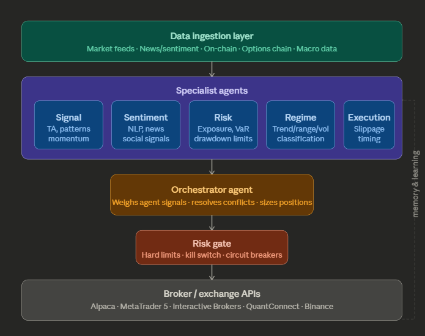

# Trade-Swarm

A multi-agent trading system that coordinates specialised agents across signal generation, risk management, and execution to deliver adaptive, risk-aware performance in live markets.

**Current version: v0.2.0** · [v0.1.0 release](https://github.com/bigmikecreates/trade-swarm/releases/tag/v0.1.0)

*(Check branches `release/{version_number}` for full codebase; main holds overview only).*

## System Architecture



<blockquote>

Click this [link](docs/specialist_agents/) for more information on each specialist agent.
</blockquote>

## System status

| Version | Branch | Status | Summary |
|---------|--------|--------|---------|
| v0.1.0 | `release/v0.1.0` | Complete | Prove the signal — EMA crossover research |
| **v0.2.0** | `release/v0.2.0` | **In progress** | Paper trading loop + basic risk rules |
| v0.3.0 | — | Planned | Second signal agent + regime detection |
| v0.4.0 | — | Planned | Orchestrator + risk agent + sentiment |
| v0.5.0 | — | Planned | Infrastructure hardening (Docker, Postgres, Grafana) |
| v0.9.0 | — | Planned | Extended paper trading + ML confidence layer |
| v1.0.0 | — | Planned | Live trading with training wheels |

---

## v0.1.0 — Prove the signal (summary)

Walk-forward validated EMA crossover on SPY, QQQ, GLD. Gate: Sharpe > 0.8, Max DD < 20%, Trades ≥ 30. HMM regime filter overfits; unfiltered crossover passes. Full details on `release/v0.1.0`: `planning/system_specs/v0.1.0/`, `planning/research/v0.1.0/RESEARCH.md`.

---

## v0.2.0 — Paper trading loop (current)

Take the validated backtest live against real market data via Alpaca paper trading. No real money.

**Prerequisites:** Alpaca paper account, Docker (for Redis via Compose)

**Setup:**
```bash
docker compose up -d
cp .env.example .env   # add Alpaca keys
pip install -e .
trade-swarm-paper
streamlit run dashboard/app.py   # P&L dashboard
```

**4-week gate:** Deploy to VPS for continuous run — see `planning/system_specs/v0.2.0/VPS_DEPLOYMENT.md` on `release/v0.2.0` (DigitalOcean).

**Exit gate:** 4 continuous weeks of paper trading, all orders logged to SQLite, P&L dashboard accurate, kill switch tested.

---

## Version roadmap

### v0.2.0 — Paper trading loop + basic risk rules *(in progress)*

Alpaca paper trading, Redis (Docker Compose) for kill switch, 4-rule risk gate, SQLite trade log, Streamlit P&L dashboard. VPS deployment for 4-week gate.

### v0.3.0 — Second signal agent + regime detection

Add a `MeanReversionAgent` (RSI + Bollinger Bands) for ranging markets alongside the existing `TrendSignalAgent`. Build a `RegimeAgent` using simpler proxies (ADX, vol percentile) first — HMM overfitted in v0.1.0 walk-forward, but may be revisited later with different methodology. Route to the appropriate strategy based on regime. Introduce Redis pub/sub for agent coordination (v0.2.0 uses direct calls).

**Exit gate:** Both agents individually profitable over 4+ weeks in paper trading, regime switching visible in logs.

### v0.4.0 — Orchestrator + risk agent + sentiment

Wire all specialist agents through a LangGraph orchestrator for final trade decisions. Add a `RiskAgent` with VaR and drawdown tracking (extends v0.2.0’s 4-rule gate). Add a `SentimentAgent` using FinBERT on Alpaca news. Expand to 2-3 assets (SPY, QQQ, GLD per v0.1.0 validation).

**Exit gate:** 8 weeks paper trading, portfolio Sharpe > 1.0, max drawdown < 15%.

### v0.5.0 — Infrastructure hardening

Full Docker stack (app + Redis + Postgres in containers; v0.2.0 has Redis-only Compose). Postgres replaces SQLite. Grafana monitoring. Upgrade kill switch from Redis flag to Telegram for remote control. Full audit log. The system must run 48 hours unattended on a VPS with no crashes or data loss.

**Exit gate:** 48h unattended run, Telegram kill switch reachable, all 16 risk gate rules active.

### v0.9.0 — Extended paper trading + ML layer

3 continuous months of paper trading across all target asset classes. XGBoost ML confidence layer on top of rule-based signals. Walk-forward parameter optimization. Stress testing against 2008, 2020, and 2022 scenarios. Use paper fill data from v0.2.0–v0.4.0 to validate the 0.1% cost model before scaling.

**Exit gate:** 3 months paper trading, Sharpe > 1.0, max drawdown < 15%, stress tests passed.

### v1.0.0 — Live trading with training wheels

Deploy real capital at 1-2% of intended allocation. Shadow mode (paper + live simultaneously). Scale only after 30 consecutive live trading days with no critical incidents and performance matching paper.

**Exit gate:** 30 live days, performance within 20% of paper, max live drawdown < 10%.

## Methodology

All strategies follow the walk-forward validation protocol defined in `planning/research/METHODOLOGY.md` (on `release/v0.1.0`):

- **Walk-forward:** 5-year train / 1-year test / 1-year step, rolling windows
- **Gate:** Sharpe > 0.8, Max DD < 20%, Trades >= 30 on concatenated OOS equity curve
- **Cost model:** flat 0.1% per trade (validate against paper fills in v0.2.0–v0.4.0; live in v1.0.0)
- **Indicators:** pure pandas, no external indicator libraries

## License

MIT
