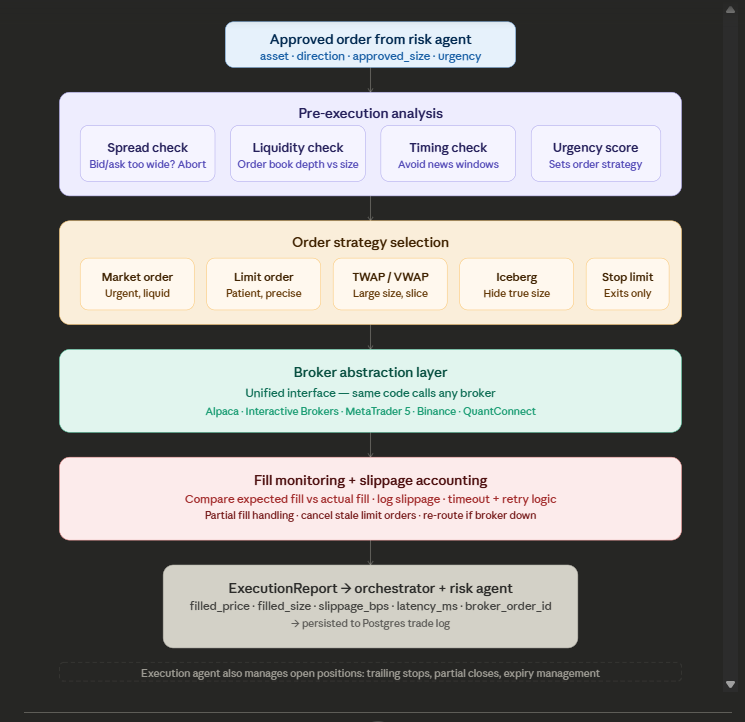

# Execution Agent

The execution agent is designed as the **hands** of the system — the last agent in the chain, and the only component that interacts with the market. Other agents reason and decide; the execution agent acts. The role appears simple but execution quality often separates profitable backtests from losing live systems.

---

## The core problem it solves: slippage and market impact

Backtests typically assume fills at the intended price. Live trading does not. The execution agent exists to narrow that gap.

**Slippage** — price moves between decision time and fill. On liquid assets at small size this is minor; on illiquid assets or large size it can erase the strategy edge.

**Market impact** — when order size is large relative to liquidity, the order itself moves price before the fill completes.

The execution agent minimises both.



## **The ExecutionRequest and ExecutionReport objects**

```python
from dataclasses import dataclass
from datetime import datetime
from enum import Enum

class OrderType(Enum):
    MARKET     = "market"
    LIMIT      = "limit"
    STOP_LIMIT = "stop_limit"
    TWAP       = "twap"
    VWAP       = "vwap"

class Urgency(Enum):
    LOW    = "low"     # patient — use limit orders, wait for good fill
    NORMAL = "normal"  # standard execution
    HIGH   = "high"    # fill now — use market order, accept slippage

@dataclass
class ExecutionRequest:
    asset:          str
    direction:      str           # "buy" or "sell"
    approved_size:  float
    urgency:        Urgency
    limit_price:    float | None  # None = market order
    stop_price:     float | None  # for stop-limit exits
    time_in_force:  str = "gtc"   # "gtc", "day", "ioc", "fok"
    max_slippage_bps: float = 10  # cancel if slippage exceeds this

@dataclass
class ExecutionReport:
    request_id:       str
    asset:            str
    direction:        str
    requested_size:   float
    filled_size:      float
    filled_price:     float
    expected_price:   float
    slippage_bps:     float       # (filled - expected) / expected * 10000
    latency_ms:       float       # time from decision to fill confirmation
    broker:           str
    broker_order_id:  str
    status:           str         # "filled", "partial", "cancelled", "failed"
    timestamp:        datetime
    fees:             float
```

The `slippage_bps` field should be tracked consistently. If average slippage is 8 bps and the strategy edge is 5 bps, production loses money despite a profitable backtest — a common failure mode for systematic strategies.

---

## The broker abstraction layer

The central architectural choice is a single unified interface so that swapping brokers — or running the same strategy on multiple brokers — requires no strategy-level changes.

```python
from abc import ABC, abstractmethod

class BrokerAdapter(ABC):
    """All brokers implement this interface. Strategy code never touches broker APIs directly."""

    @abstractmethod
    def place_order(self, request: ExecutionRequest) -> str:
        """Returns broker_order_id."""

    @abstractmethod
    def get_order_status(self, broker_order_id: str) -> dict:
        """Returns fill status, filled_qty, avg_price."""

    @abstractmethod
    def cancel_order(self, broker_order_id: str) -> bool:

    @abstractmethod
    def get_positions(self) -> list[dict]:

    @abstractmethod
    def get_account_equity(self) -> float:

class AlpacaAdapter(BrokerAdapter):
    def __init__(self, api_key: str, secret_key: str, paper: bool = True):
        import alpaca_trade_api as tradeapi
        base_url = "https://paper-api.alpaca.markets" if paper else "https://api.alpaca.markets"
        self.api = tradeapi.REST(api_key, secret_key, base_url)

    def place_order(self, request: ExecutionRequest) -> str:
        side       = "buy" if request.direction == "buy" else "sell"
        order_type = "market" if request.limit_price is None else "limit"
        order = self.api.submit_order(
            symbol        = request.asset,
            qty           = request.approved_size,
            side          = side,
            type          = order_type,
            time_in_force = request.time_in_force,
            limit_price   = request.limit_price,
        )
        return order.id

    def get_order_status(self, broker_order_id: str) -> dict:
        order = self.api.get_order(broker_order_id)
        return {
            "status":     order.status,
            "filled_qty": float(order.filled_qty or 0),
            "avg_price":  float(order.filled_avg_price or 0),
        }

    def cancel_order(self, broker_order_id: str) -> bool:
        try:
            self.api.cancel_order(broker_order_id)
            return True
        except Exception:
            return False

    def get_positions(self) -> list[dict]:
        return [{"asset": p.symbol, "qty": float(p.qty), "avg_price": float(p.avg_entry_price)}
                for p in self.api.list_positions()]

    def get_account_equity(self) -> float:
        return float(self.api.get_account().equity)

class IBKRAdapter(BrokerAdapter):
    """Interactive Brokers via ib_insync."""
    def __init__(self, host: str = "127.0.0.1", port: int = 7497, client_id: int = 1):
        from ib_insync import IB, Stock, MarketOrder, LimitOrder
        self.ib = IB()
        self.ib.connect(host, port, clientId=client_id)
        self._Stock        = Stock
        self._MarketOrder  = MarketOrder
        self._LimitOrder   = LimitOrder

    def place_order(self, request: ExecutionRequest) -> str:
        contract = self._Stock(request.asset, "SMART", "USD")
        action   = "BUY" if request.direction == "buy" else "SELL"
        if request.limit_price:
            order = self._LimitOrder(action, request.approved_size, request.limit_price)
        else:
            order = self._MarketOrder(action, request.approved_size)
        trade = self.ib.placeOrder(contract, order)
        self.ib.sleep(0.1)
        return str(trade.order.orderId)

    # ... implement remaining abstract methods
```

Adding MetaTrader 5 or Binance requires a new adapter class only; the rest of the system stays unchanged.

---

## Order strategy selection

The execution agent picks the right order type based on urgency and market conditions:

```python
import time

class ExecutionAgent:
    def __init__(self, broker: BrokerAdapter):
        self.broker = broker

    def execute(self, request: ExecutionRequest) -> ExecutionReport:
        # 1. Pre-execution checks
        if not self._pre_checks_pass(request):
            return self._failed_report(request, "Pre-execution checks failed")

        # 2. Select strategy
        strategy = self._select_strategy(request)

        # 3. Execute and monitor
        return strategy(request)

    def _select_strategy(self, request: ExecutionRequest):
        if request.urgency == Urgency.HIGH:
            return self._market_order
        elif request.urgency == Urgency.LOW:
            return self._patient_limit_order
        else:
            return self._adaptive_limit_order  # try limit, fall back to market

    def _market_order(self, request: ExecutionRequest) -> ExecutionReport:
        expected_price = self._get_mid_price(request.asset)
        t0             = time.time()
        order_id       = self.broker.place_order(request)
        fill           = self._wait_for_fill(order_id, timeout_seconds=5)
        latency_ms     = (time.time() - t0) * 1000
        slippage_bps   = ((fill["avg_price"] - expected_price) / expected_price) * 10000

        return ExecutionReport(
            request_id     = order_id,
            asset          = request.asset,
            direction      = request.direction,
            requested_size = request.approved_size,
            filled_size    = fill["filled_qty"],
            filled_price   = fill["avg_price"],
            expected_price = expected_price,
            slippage_bps   = slippage_bps,
            latency_ms     = latency_ms,
            broker         = self.broker.__class__.__name__,
            broker_order_id = order_id,
            status         = "filled",
            timestamp      = datetime.utcnow(),
            fees           = fill["filled_qty"] * fill["avg_price"] * 0.001,
        )

    def _patient_limit_order(self, request: ExecutionRequest) -> ExecutionReport:
        """Place at bid/ask, chase price every 30s, give up after 5 minutes."""
        deadline = time.time() + 300  # 5 minute timeout
        while time.time() < deadline:
            limit_price = self._get_favorable_price(request)
            req         = ExecutionRequest(**{**request.__dict__, "limit_price": limit_price})
            order_id    = self.broker.place_order(req)
            fill        = self._wait_for_fill(order_id, timeout_seconds=30)
            if fill["status"] == "filled":
                return self._build_report(request, fill, order_id)
            self.broker.cancel_order(order_id)  # price moved, re-price

        # Fall back to market after timeout
        return self._market_order(request)

    def _wait_for_fill(self, order_id: str, timeout_seconds: int) -> dict:
        deadline = time.time() + timeout_seconds
        while time.time() < deadline:
            status = self.broker.get_order_status(order_id)
            if status["status"] in ("filled", "partially_filled", "cancelled"):
                return status
            time.sleep(0.5)
        return {"status": "timeout", "filled_qty": 0, "avg_price": 0}
```

---

## TWAP execution for large orders

Time-Weighted Average Price slices a large order into smaller chunks spread over time, reducing market impact:

```python
import time

def execute_twap(
    agent:          ExecutionAgent,
    request:        ExecutionRequest,
    duration_mins:  int   = 30,
    num_slices:     int   = 10,
) -> list[ExecutionReport]:
    """
    Splits a large order into num_slices equal pieces
    spread evenly over duration_mins minutes.
    """
    slice_size     = request.approved_size / num_slices
    interval_secs  = (duration_mins * 60) / num_slices
    reports        = []

    for i in range(num_slices):
        slice_req = ExecutionRequest(
            asset          = request.asset,
            direction      = request.direction,
            approved_size  = slice_size,
            urgency        = Urgency.LOW,   # patient on each slice
            limit_price    = None,
            stop_price     = None,
        )
        report = agent.execute(slice_req)
        reports.append(report)

        if i < num_slices - 1:
            time.sleep(interval_secs)

    return reports
```

TWAP is most relevant for crypto (lower liquidity) and large equity positions. Forex at retail size is often liquid enough that TWAP is unnecessary.

---

## Slippage measurement and feedback

This feedback loop distinguishes professional from amateur execution. After every fill, actual vs expected should be measured and recorded:

```python
from collections import deque
import statistics

class SlippageTracker:
    def __init__(self, window: int = 100):
        self.history: deque = deque(maxlen=window)

    def record(self, report: ExecutionReport):
        self.history.append(report.slippage_bps)

    @property
    def avg_slippage_bps(self) -> float:
        return statistics.mean(self.history) if self.history else 0.0

    @property
    def p95_slippage_bps(self) -> float:
        """95th percentile — tail risk in practice."""
        if len(self.history) < 20:
            return 0.0
        sorted_h = sorted(self.history)
        idx      = int(len(sorted_h) * 0.95)
        return sorted_h[idx]

    def is_deteriorating(self, threshold_bps: float = 15.0) -> bool:
        """Alert if recent slippage is getting worse."""
        if len(self.history) < 20:
            return False
        recent = list(self.history)[-20:]
        return statistics.mean(recent) > threshold_bps
```

If `is_deteriorating()` returns `True`, the execution agent should notify the risk agent — deteriorating fill quality can indicate strategy edge erosion or a regime change.

---

## Critical timing rules

**News windows.** New orders should not be submitted within ~2 minutes before or ~5 minutes after scheduled macro events (NFP, CPI, FOMC). Spreads widen, liquidity thins, and fills become unpredictable. The execution agent can check an economic calendar before submission:

```python
def is_news_window(asset: str, calendar: list[dict], buffer_minutes: int = 5) -> bool:
    now = datetime.utcnow()
    for event in calendar:
        event_time = event["datetime"]
        delta      = abs((now - event_time).total_seconds() / 60)
        if delta < buffer_minutes and event.get("impact") == "high":
            return True
    return False
```

**Session boundaries.** Orders in the first and last ~5 minutes of a session often see wider spreads and thinner liquidity — especially in equities and forex.

**Crypto has no session boundaries** but it has its own timing traps: major exchange maintenance windows, funding rate resets (every 8 hours on perpetuals), and weekend liquidity drops.

---

## v0.2.0 scope

For paper trading, four components are sufficient:

1. `AlpacaAdapter` implementing the `BrokerAdapter` interface — market and limit orders only
2. Basic `ExecutionAgent.execute()` with market order support
3. `SlippageTracker` logging every fill to SQLite
4. A simple retry loop — if a fill times out, cancel and resubmit once before raising an alert

TWAP, iceberg, and patient limit strategies fit later (e.g. v0.4.0) when multiple assets and larger sizes require them. v0.2.0 prioritises reliable fills first.
