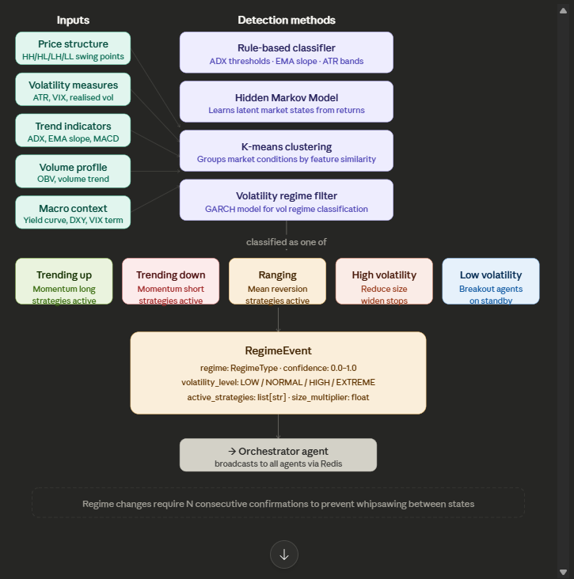

# Regime Agent

The regime detection agent is designed as the **navigator** of the system — it summarises the macro shape of the market so other agents know what environment they operate in. A trend-following signal that performs in a bull run can fail in a sideways market; the regime agent gates strategies on and off by condition.



---

## The core idea: markets have distinct personalities

Markets do not behave uniformly. They move through identifiable states; strategies that work in one state are often incompatible with others. Correct classification is high-leverage design.

---

## The five regimes and what they imply for agents

**Trending up** — ADX > 25, higher highs and higher lows, EMA 20 above EMA 50 above EMA 200. Activate `TrendSignalAgent` at full size; suppress `MeanReversionAgent` — it tends to fight the trend.

**Trending down** — same criteria inverted. Trend agent active on the short side. Equities require attention to shorting rules; forex and crypto are more symmetric.

**Ranging** — ADX < 20, price between support and resistance, low directional movement. Trend agents are suppressed; `MeanReversionAgent` is active. Profit targets stay tight because range extent is limited.

**High volatility** — ATR well above its 20-period average, VIX elevated, large candle bodies. High-risk regime: position sizes cut 50–75%, stops widened to reduce noise exits, breakout strategies often suppressed when fake breakouts cluster.

**Low volatility** — ATR contracting, Bollinger Bands squeezing. Market often coiling for a move. Breakout agents go on standby; aggressive mean reversion is risky if a volatility expansion is imminent.

---

## **The RegimeEvent output object**

```python
from dataclasses import dataclass, field
from datetime import datetime
from enum import Enum

class RegimeType(Enum):
    TRENDING_UP   = "trending_up"
    TRENDING_DOWN = "trending_down"
    RANGING       = "ranging"
    HIGH_VOL      = "high_volatility"
    LOW_VOL       = "low_volatility"

class VolatilityLevel(Enum):
    LOW     = "low"
    NORMAL  = "normal"
    HIGH    = "high"
    EXTREME = "extreme"

@dataclass
class RegimeEvent:
    asset:              str
    regime:             RegimeType
    confidence:         float             # 0.0–1.0
    volatility_level:   VolatilityLevel
    active_strategies:  list[str]         # which agents should be live
    size_multiplier:    float             # 1.0 = full size, 0.5 = half size
    adx:                float
    atr_ratio:          float             # current ATR / 20-period avg ATR
    timestamp:          datetime
    bars_in_regime:     int               # how long we've been in this state
```

The `size_multiplier` is passed to the risk agent so position sizes scale down in dangerous regimes without every agent re-implementing logic.

---

## Method 1 — rule-based classifier (build this first)

The rule-based path is transparent, debuggable, and sufficient for a v0.3.0-style implementation:

```python
import pandas as pd
import pandas_ta as ta

class RuleBasedRegimeClassifier:

    def classify(self, df: pd.DataFrame) -> RegimeEvent:
        df = df.copy()
        df.ta.adx(length=14, append=True)
        df.ta.ema(length=20, append=True)
        df.ta.ema(length=50, append=True)
        df.ta.atr(length=14, append=True)

        df.dropna(inplace=True)
        last = df.iloc[-1]

        adx      = last["ADX_14"]
        dmp      = last["DMP_14"]      # +DI  (bullish pressure)
        dmn      = last["DMN_14"]      # -DI  (bearish pressure)
        ema20    = last["EMA_20"]
        ema50    = last["EMA_50"]
        atr_now  = last["ATRr_14"]
        atr_avg  = df["ATRr_14"].rolling(20).mean().iloc[-1]
        atr_ratio = atr_now / atr_avg if atr_avg > 0 else 1.0

        # Volatility level
        if atr_ratio > 2.0:
            vol_level = VolatilityLevel.EXTREME
        elif atr_ratio > 1.4:
            vol_level = VolatilityLevel.HIGH
        elif atr_ratio < 0.7:
            vol_level = VolatilityLevel.LOW
        else:
            vol_level = VolatilityLevel.NORMAL

        # Regime classification
        if vol_level in (VolatilityLevel.HIGH, VolatilityLevel.EXTREME):
            regime             = RegimeType.HIGH_VOL
            active_strategies  = []          # nothing trades in chaos
            size_multiplier    = 0.25
            confidence         = 0.9

        elif adx > 25 and dmp > dmn and ema20 > ema50:
            regime             = RegimeType.TRENDING_UP
            active_strategies  = ["TrendSignalAgent"]
            size_multiplier    = 1.0
            confidence         = min(adx / 50, 1.0)

        elif adx > 25 and dmn > dmp and ema20 < ema50:
            regime             = RegimeType.TRENDING_DOWN
            active_strategies  = ["TrendSignalAgent"]
            size_multiplier    = 1.0
            confidence         = min(adx / 50, 1.0)

        elif vol_level == VolatilityLevel.LOW:
            regime             = RegimeType.LOW_VOL
            active_strategies  = ["BreakoutAgent"]
            size_multiplier    = 0.75
            confidence         = 0.7

        else:
            regime             = RegimeType.RANGING
            active_strategies  = ["MeanReversionAgent"]
            size_multiplier    = 0.8
            confidence         = max(0.0, 1.0 - (adx / 25))

        return RegimeEvent(
            asset=df.attrs.get("symbol", "UNKNOWN"),
            regime=regime,
            confidence=round(confidence, 4),
            volatility_level=vol_level,
            active_strategies=active_strategies,
            size_multiplier=size_multiplier,
            adx=round(adx, 2),
            atr_ratio=round(atr_ratio, 4),
            timestamp=datetime.utcnow(),
            bars_in_regime=0   # tracked separately by the agent
        )
```

---

## Method 2 — Hidden Markov Model (later, e.g. v0.9.0)

The rule-based classifier encodes explicit assumptions. An HMM learns regime structure from price data — it approximates latent states rather than hand-coded rules.

```python
from hmmlearn.hmm import GaussianHMM
import numpy as np
import pandas as pd

class HMMRegimeClassifier:

    def __init__(self, n_states: int = 4):
        self.n_states  = n_states
        self.model     = GaussianHMM(
            n_components=n_states,
            covariance_type="full",
            n_iter=1000,
            random_state=42
        )
        self.is_fitted  = False
        self.state_map  = {}   # maps HMM state index → RegimeType

    def _build_features(self, df: pd.DataFrame) -> np.ndarray:
        returns  = df["Close"].pct_change()
        vol      = returns.rolling(5).std()
        features = pd.concat([returns, vol], axis=1).dropna()
        return features.values

    def fit(self, df: pd.DataFrame):
        """Train on historical data. Call once on 2+ years of data."""
        X = self._build_features(df)
        self.model.fit(X)
        self.is_fitted = True
        self._label_states(df)

    def _label_states(self, df: pd.DataFrame):
        """Map each learned state to a human-readable regime by its properties."""
        X       = self._build_features(df)
        states  = self.model.predict(X)
        returns = df["Close"].pct_change().dropna()

        for s in range(self.n_states):
            mask         = states == s
            mean_ret     = returns.values[mask].mean()
            mean_vol     = returns.values[mask].std()

            if mean_vol > returns.std() * 1.5:
                self.state_map[s] = RegimeType.HIGH_VOL
            elif mean_ret > 0 and mean_vol < returns.std():
                self.state_map[s] = RegimeType.TRENDING_UP
            elif mean_ret < 0 and mean_vol < returns.std():
                self.state_map[s] = RegimeType.TRENDING_DOWN
            else:
                self.state_map[s] = RegimeType.RANGING

    def predict(self, df: pd.DataFrame) -> RegimeType:
        """Predict the current regime from recent bars."""
        X            = self._build_features(df.tail(100))
        state        = self.model.predict(X)[-1]
        return self.state_map.get(state, RegimeType.RANGING)
```

HMM also yields **state transition probabilities** — not only the current regime but the likelihood of moving to another regime within the next N bars, which helps downstream agents anticipate change.

---

## The confirmation buffer — reducing whipsaw

Regime boundaries oscillate. Without a buffer, a system can flip between RANGING and TRENDING_UP every few bars, producing false switches and excess cost.

```python
from collections import deque

class RegimeAgent:

    def __init__(self, classifier, confirmation_bars: int = 3):
        self.classifier        = classifier
        self.confirmation_bars = confirmation_bars
        self.candidate_buffer  = deque(maxlen=confirmation_bars)
        self.current_regime    = None

    def update(self, df: pd.DataFrame) -> RegimeEvent | None:
        """
        Returns a new RegimeEvent only when a regime change is confirmed.
        Returns None if regime is stable or change is unconfirmed.
        """
        new_event = self.classifier.classify(df)
        self.candidate_buffer.append(new_event.regime)

        # Only confirm a change if all buffered bars agree
        if len(self.candidate_buffer) == self.confirmation_bars:
            all_agree = len(set(self.candidate_buffer)) == 1
            candidate = self.candidate_buffer[-1]

            if all_agree and candidate != self.current_regime:
                self.current_regime = candidate
                return new_event   # broadcast this regime change

        return None   # no confirmed change, stay quiet
```

With `confirmation_bars=3`, three consecutive bars must agree on the new regime before downstream agents are notified. That removes most spurious switches.

---

## Multi-timeframe regime consensus

As with signal agents, multi-timeframe agreement improves regime calls. A regime visible on both daily and 4H is more reliable than one seen only on 1H:

```python
class MultiTimeframeRegimeAgent:

    def __init__(self):
        self.agents = {
            "1D": RegimeAgent(RuleBasedRegimeClassifier(), confirmation_bars=3),
            "4H": RegimeAgent(RuleBasedRegimeClassifier(), confirmation_bars=4),
            "1H": RegimeAgent(RuleBasedRegimeClassifier(), confirmation_bars=6),
        }

    def get_consensus(self, data: dict[str, pd.DataFrame]) -> RegimeType:
        regimes = {}
        for tf, agent in self.agents.items():
            event = agent.classifier.classify(data[tf])
            regimes[tf] = event.regime

        # Weight: daily carries most authority
        weights = {"1D": 3, "4H": 2, "1H": 1}
        scores  = {}
        for regime in RegimeType:
            scores[regime] = sum(
                weights[tf] for tf, r in regimes.items() if r == regime
            )

        return max(scores, key=scores.get)
```

Daily carries 3 votes, 4H carries 2, 1H carries 1. A 1H anomaly alone cannot override a stable daily trend.

---

## Integration with the rest of the system

On a confirmed regime change, a `RegimeEvent` broadcasts on a Redis channel; other agents subscribe and adjust behaviour.

```python
import redis, json

r = redis.Redis()

def broadcast_regime(event: RegimeEvent):
    payload = {
        "regime":            event.regime.value,
        "confidence":        event.confidence,
        "volatility_level":  event.volatility_level.value,
        "active_strategies": event.active_strategies,
        "size_multiplier":   event.size_multiplier,
        "timestamp":         event.timestamp.isoformat(),
    }
    r.publish("regime_updates", json.dumps(payload))

# In each signal agent:
def listen_for_regime(self):
    pubsub = r.pubsub()
    pubsub.subscribe("regime_updates")
    for message in pubsub.listen():
        if message["type"] == "message":
            event = json.loads(message["data"])
            self.active = self.agent_name in event["active_strategies"]
            self.size_multiplier = event["size_multiplier"]
```

Each signal agent checks `self.active` before emitting. If the regime agent has not selected it, it remains silent — no noise for the orchestrator.

---

## v0.3.0 scope

A minimal milestone includes:

1. **Rule-based classifier** using ADX, EMA slope, and ATR ratio — on the order of 50 lines
2. **Confirmation buffer** with `confirmation_bars=3` — limits whipsaw
3. **Redis broadcast** so `TrendSignalAgent` and `MeanReversionAgent` receive regime changes and enable/disable accordingly

HMM is deferred to later (e.g. v0.9.0) after sufficient live paper data exists for the traded universe. Training an HMM on data that was never used in production is a form of look-ahead bias.
