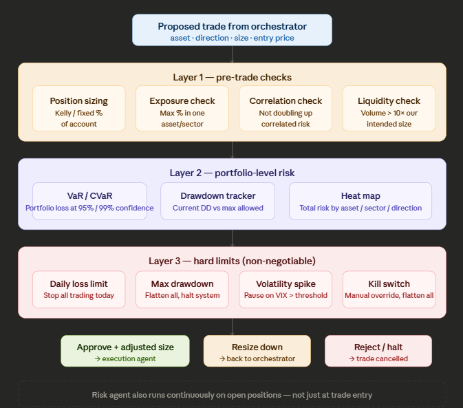

# Risk Agent

The risk agent is designed as the **immune system** of the trading system. Other agents optimise for return; the risk agent has a single mandate: prevent catastrophic loss. It holds veto power over everything, including the orchestrator.



---

## The fundamental mindset shift

Naive risk handling often reduces to "set a stop loss." Professional risk management is a different discipline — it concerns **surviving all plausible market conditions**, not only typical ones. The risk agent is specified to answer three questions continuously:

- Maximum loss on a single trade
- Maximum loss across all open positions simultaneously
- Worst-case realistic scenario and whether the account can survive it

---

## The RiskEvent output object

As with the signal agent, the risk agent uses a clean structured output:

```python
from dataclasses import dataclass
from enum import Enum
from datetime import datetime

class RiskDecision(Enum):
    APPROVE  = "approve"
    RESIZE   = "resize"    # approved but at a smaller size
    REJECT   = "reject"    # this trade specifically is blocked
    HALT     = "halt"      # stop all trading, flatten positions

@dataclass
class RiskEvent:
    decision:        RiskDecision
    approved_size:   float        # may differ from requested size
    rejection_reason: str | None  # populated if REJECT or HALT
    portfolio_heat:  float        # 0.0–1.0, how "loaded" the book is
    current_drawdown: float       # % from equity high watermark
    daily_pnl:       float        # today's realised + unrealised P&L
    timestamp:       datetime
```

---

## Layer 1 — position sizing in detail

This is the most important calculation in the entire system. Incorrect sizing is a primary cause of account failure.

The simplest robust method is **fixed fractional sizing** — never risk more than X% of account equity on a single trade. For a new system, X is typically 1–2%.

```python
def calculate_position_size(
    account_equity:  float,
    entry_price:     float,
    stop_loss_price: float,
    risk_pct:        float = 0.01   # 1% of account per trade
) -> float:
    """
    Returns number of units to trade.
    Risk is defined as: (entry - stop) × units = max_loss
    """
    max_loss_dollars = account_equity * risk_pct
    risk_per_unit    = abs(entry_price - stop_loss_price)

    if risk_per_unit == 0:
        return 0.0

    units = max_loss_dollars / risk_per_unit
    return round(units, 4)

# Example:
# account = $10,000, entry = $100, stop = $97, risk = 1%
# max_loss = $100, risk_per_unit = $3, units = 33.3
```

The **Kelly Criterion** is the mathematically optimal version of this, but it is aggressive — half-Kelly or quarter-Kelly is common practice because win-rate estimates are never perfect:

```python
def kelly_fraction(win_rate: float, avg_win: float, avg_loss: float) -> float:
    """
    Returns the fraction of account to risk.
    win_rate: historical % of winning trades (0.0–1.0)
    avg_win:  average winning trade in dollars
    avg_loss: average losing trade in dollars (positive number)
    """
    if avg_loss == 0:
        return 0.0
    b = avg_win / avg_loss          # win/loss ratio
    q = 1 - win_rate
    kelly = (b * win_rate - q) / b
    return max(0.0, kelly * 0.25)   # quarter-Kelly for safety
```

---

## Layer 2 — Value at Risk (VaR)

VaR answers: "What is the maximum loss over the next N days, with 95% confidence?" It is the standard measure used on professional trading desks.

```python
import numpy as np
import pandas as pd

def calculate_var(
    returns:     pd.Series,    # historical daily returns of portfolio
    confidence:  float = 0.95,
    horizon_days: int  = 1
) -> float:
    """
    Returns VaR as a positive dollar loss figure.
    Uses historical simulation method — no distribution assumptions.
    """
    var_pct = np.percentile(returns, (1 - confidence) * 100)
    return abs(var_pct) * np.sqrt(horizon_days)

def calculate_cvar(returns: pd.Series, confidence: float = 0.95) -> float:
    """
    CVaR (Conditional VaR / Expected Shortfall):
    Average loss in the worst (1-confidence)% of cases.
    More conservative and informative than plain VaR.
    """
    var_threshold = np.percentile(returns, (1 - confidence) * 100)
    tail_losses   = returns[returns <= var_threshold]
    return abs(tail_losses.mean())
```

CVaR is often more informative than VaR alone: VaR gives the threshold; CVaR describes the tail beyond it.

---

## Layer 3 — the hard limits in code

These are non-negotiable rules, evaluated first — before position sizing, before VaR, before anything else:

```python
@dataclass
class RiskLimits:
    max_daily_loss_pct:    float = 0.03   # halt if down 3% in a day
    max_drawdown_pct:      float = 0.15   # halt if down 15% from peak
    max_position_pct:      float = 0.10   # no single position > 10% of account
    max_sector_pct:        float = 0.25   # no sector > 25%
    max_correlated_pct:    float = 0.30   # correlated assets combined < 30%
    vix_halt_threshold:    float = 35.0   # pause trading if VIX > 35
    min_liquidity_ratio:   float = 10.0   # volume must be 10× order size

class RiskAgent:
    def __init__(self, limits: RiskLimits, account_equity: float):
        self.limits        = limits
        self.equity        = account_equity
        self.peak_equity   = account_equity
        self.daily_start   = account_equity
        self.kill_switch   = False          # manual override flag

    def check_hard_limits(self, current_equity: float, vix: float) -> RiskEvent | None:
        """Returns a HALT RiskEvent if any hard limit is breached, else None."""

        if self.kill_switch:
            return self._halt("Manual kill switch activated")

        daily_loss_pct = (self.daily_start - current_equity) / self.daily_start
        if daily_loss_pct >= self.limits.max_daily_loss_pct:
            return self._halt(f"Daily loss limit hit: {daily_loss_pct:.1%}")

        self.peak_equity   = max(self.peak_equity, current_equity)
        drawdown_pct       = (self.peak_equity - current_equity) / self.peak_equity
        if drawdown_pct >= self.limits.max_drawdown_pct:
            return self._halt(f"Max drawdown hit: {drawdown_pct:.1%}")

        if vix > self.limits.vix_halt_threshold:
            return self._halt(f"VIX too high: {vix:.1f}")

        return None   # all clear

    def _halt(self, reason: str) -> RiskEvent:
        return RiskEvent(
            decision=RiskDecision.HALT,
            approved_size=0.0,
            rejection_reason=reason,
            portfolio_heat=1.0,
            current_drawdown=0.0,
            daily_pnl=0.0,
            timestamp=datetime.utcnow()
        )
```

---

## The drawdown ladder — scaling risk as equity falls

Rather than a single cliff at 15%, a **drawdown ladder** progressively reduces risk as drawdown increases, so the system de-risks before an emergency stop:

| Drawdown from peak | Action |
| --- | --- |
| 0–5% | Full size, normal operation |
| 5–8% | Reduce position sizes by 25% |
| 8–12% | Reduce position sizes by 50%, no new strategies |
| 12–15% | Reduce to minimum size, review only |
| 15%+ | Full halt, flatten all positions, human review required |

This yields graceful degradation rather than a sudden hard stop. Implementation belongs in `RiskAgent.calculate_size_multiplier()`.

---

## Correlation risk — a common oversight

Simultaneous long EURUSD, long GBPUSD, and long AUDUSD are not three independent trades — they are correlated bets on USD weakness. If the dollar rallies, all three can lose together, turning per-trade risk limits into a combined larger loss.

```python
import pandas as pd
import numpy as np

def get_correlation_matrix(price_history: dict[str, pd.Series]) -> pd.DataFrame:
    df      = pd.DataFrame(price_history).pct_change().dropna()
    return df.corr()

def check_correlation_risk(
    proposed_asset:   str,
    open_positions:   list[str],
    corr_matrix:      pd.DataFrame,
    threshold:        float = 0.7
) -> list[str]:
    """Returns list of open positions highly correlated with the proposed trade."""
    if proposed_asset not in corr_matrix.columns:
        return []
    correlated = []
    for pos in open_positions:
        if pos in corr_matrix.columns:
            corr = corr_matrix.loc[proposed_asset, pos]
            if abs(corr) >= threshold:
                correlated.append(pos)
    return correlated
```

If `correlated` is non-empty, the risk agent should reject the trade or reduce size proportionally.

---

## v0.1.0 scope

For an initial backtest phase, two components suffice:

1. **Fixed fractional position sizing** — the `calculate_position_size()` function above. Every backtest trade should use this, not a fixed lot size.
2. **A stop loss on every trade** — even a static ATR-based stop. No entry without a defined exit if wrong.

VaR, correlation checks, and the drawdown ladder belong in later versions (e.g. v0.4.0) when portfolio complexity warrants them. The risk layer should not outpace the rest of the system.
