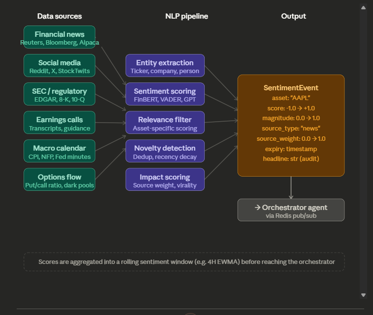

# Sentiment Agent

The sentiment agent is the system's **ear to the ground** — it ingests news, social media, filings, and macro feeds so that price-based agents are not the only input. While the signal agent consumes charts, the sentiment agent converts unstructured text into a scored, structured view the orchestrator can use.



## The NLP models — selection and use

Not all sentiment models are equal for financial text. General-purpose models like plain VADER misread financial language — "the stock crushed earnings" is positive, but a naive model can misfire on "crushed."

**FinBERT** is a common baseline. It is a BERT model fine-tuned on financial news and analyst reports. It outputs three probabilities — positive, negative, neutral — and handles financial jargon. Suitable for news headlines and filings.

**VADER** is fast and rule-based. Suited to high-volume social media where sub-millisecond scoring matters. Pair with a financial lexicon override to correct systematic misclassifications.

**GPT-based scoring** (via API) is the most flexible option for long-form text such as earnings call transcripts or Fed minutes. It is slower and more expensive; it is typically reserved for scheduled macro events rather than real-time feeds.

```python
import requests
from transformers import pipeline

# FinBERT for news headlines
finbert = pipeline("text-classification",
                   model="ProsusAI/finbert",
                   return_all_scores=True)

def score_headline(text: str) -> dict:
    scores = finbert(text)[0]
    score_map = {s["label"]: s["score"] for s in scores}
    # Convert to single -1.0 → +1.0 value
    sentiment = score_map["positive"] - score_map["negative"]
    magnitude = max(score_map["positive"], score_map["negative"])
    return {"score": round(sentiment, 4), "magnitude": round(magnitude, 4)}
```

---

## The hardest problem: relevance filtering

The dominant failure mode is not bad NLP — it is **acting on irrelevant news**. "Apple announces new iPhone" should not move an AAPL position the same way "Apple faces antitrust breakup" does. Two layers of filtering are required before the orchestrator:

**Asset relevance** — does the article concern held or watched assets? Named-entity recognition extracts tickers and company names, cross-referenced against a watchlist. Non-matches are discarded.

**Market relevance** — is the content genuinely market-moving or background noise? A lightweight classifier trained on labelled "price-moving" vs "noise" headlines works. Features: source credibility, headline length, presence of numbers/percentages, publication time relative to market hours.

```python
import spacy

nlp = spacy.load("en_core_web_sm")

WATCHLIST = {"AAPL", "BTC", "EURUSD", "NVDA"}

def extract_relevant_tickers(text: str) -> list[str]:
    doc = nlp(text)
    found = set()
    for ent in doc.ents:
        if ent.label_ in ("ORG", "PRODUCT"):
            # Simple lookup — in production use a full ticker→company map
            for ticker in WATCHLIST:
                if ticker.lower() in ent.text.lower():
                    found.add(ticker)
    return list(found)
```

---

## Novelty detection — avoiding duplicate stories

News propagates; one wire story may appear across dozens of outlets. Without deduplication, a rolling sentiment window is flooded with the same story and overstates impact.

**Semantic deduplication** uses sentence embeddings. Incoming headlines are embedded; cosine similarity is checked against a short-lived cache (e.g. 2-hour TTL in Redis); matches above ~0.92 similarity are dropped:

```python
from sentence_transformers import SentenceTransformer
import numpy as np
import redis

model = SentenceTransformer("all-MiniLM-L6-v2")
r = redis.Redis()

def is_duplicate(headline: str, threshold: float = 0.92) -> bool:
    new_emb = model.encode(headline)
    cached = r.lrange("recent_embeddings", 0, 99)  # last 100 headlines
    for raw in cached:
        old_emb = np.frombuffer(raw, dtype=np.float32)
        sim = np.dot(new_emb, old_emb) / (
              np.linalg.norm(new_emb) * np.linalg.norm(old_emb))
        if sim > threshold:
            return True
    # Store new embedding with 2h TTL
    r.lpush("recent_embeddings", new_emb.astype(np.float32).tobytes())
    r.expire("recent_embeddings", 7200)
    return False
```

---

## The rolling sentiment window

Raw per-article scores are too noisy to trade directly. The orchestrator needs a **smoothed aggregate** — a rolling sentiment score per asset that decays over time. Recent news weighs more than news from hours ago.

An exponentially weighted moving average (EWMA) with a half-life matched to the trading timeframe is standard:

| Trading style | Sentiment window | Half-life |
| --- | --- | --- |
| Scalping | 15–30 min | 10 min |
| Intraday | 2–4 hours | 1 hour |
| Swing trading | 1–3 days | 12 hours |
| Position trading | 1–2 weeks | 48 hours |

```python
from collections import deque
import math, time

class SentimentWindow:
    def __init__(self, half_life_seconds: float):
        self.half_life = half_life_seconds
        self.events: deque = deque(maxlen=500)

    def add(self, score: float, magnitude: float, source_weight: float):
        self.events.append({
            "score": score,
            "magnitude": magnitude,
            "weight": source_weight,
            "ts": time.time()
        })

    def aggregate(self) -> float:
        now = time.time()
        weighted_sum, total_weight = 0.0, 0.0
        for e in self.events:
            age = now - e["ts"]
            decay = math.exp(-age * math.log(2) / self.half_life)
            w = decay * e["magnitude"] * e["weight"]
            weighted_sum += e["score"] * w
            total_weight  += w
        return weighted_sum / total_weight if total_weight > 0 else 0.0
```

---

## Source weighting — not all opinions are equal

A major wire story should carry more weight than a forum post. Credibility scores per source category feed into the `source_weight` field of each `SentimentEvent`:

| Source type | Weight | Rationale |
| --- | --- | --- |
| Major wire (Reuters, Bloomberg) | 0.95 | Fast, accurate, high market impact |
| SEC filings (8-K, earnings) | 0.90 | Official, binding disclosures |
| Tier-1 financial press | 0.75 | WSJ, FT — authoritative but slower |
| Analyst reports | 0.70 | High signal but often lagging |
| Social media (verified accounts) | 0.40 | Fast but noisy |
| Reddit / forums | 0.20 | Useful for crypto, very noisy |
| Unknown / unverified | 0.05 | Near-discard |

---

## Sentiment reversal pattern

**Extreme positive sentiment is often a sell signal**, not a buy. When headlines are uniformly euphoric, buyers may already be positioned. The same logic applies in reverse at capitulation.

The sentiment agent should track not only level but **rate of change**. A rapid move from -0.2 to +0.8 differs materially from a stable +0.8. That derivative can be exposed to the orchestrator separately so the risk agent can flag contrarian setups.
