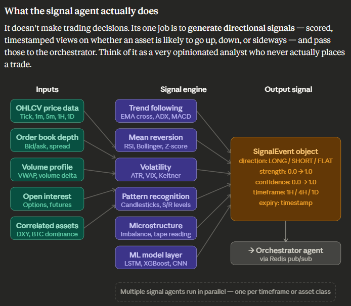

# Signal Agent

The signal agent functions as the **perception layer** of the system — it ingests price data and encodes whether a tradeable opportunity exists.



---

## The signal output object — this is critical

Every signal should be a structured object, not merely a "buy" or "sell" string. A well-designed `SignalEvent` in Python:

```python
from dataclasses import dataclass, field
from datetime import datetime
from enum import Enum

class Direction(Enum):
    LONG  = "long"
    SHORT = "short"
    FLAT  = "flat"   # exit / no position

@dataclass
class SignalEvent:
    agent_id:    str           # which signal agent produced this
    asset:       str           # e.g. "EURUSD", "BTC/USDT", "AAPL"
    direction:   Direction
    strength:    float         # 0.0–1.0  (how strong the setup is)
    confidence:  float         # 0.0–1.0  (how reliable this signal type is historically)
    timeframe:   str           # "1H", "4H", "1D"
    timestamp:   datetime
    expiry:      datetime      # signal is stale after this
    indicators:  dict = field(default_factory=dict)  # audit trail
    # e.g. indicators = {"rsi": 28.4, "ema_cross": True, "atr": 0.0042}
```

The `strength` × `confidence` product is what the orchestrator uses to weight this signal against others. An agent that is historically right 70% of the time (confidence = 0.7) reporting a very strong setup (strength = 0.9) yields a combined score of 0.63 — more actionable than a weak signal from an unreliable strategy.

---

## The sub-strategies inside one signal agent

In a multi-asset setup, a single monolithic signal agent is usually insufficient. A **family of signal agents**, each specialised, is preferable:

| Agent name | Best for | Core indicators | Timeframe |
|---|---|---|---|
| `TrendSignalAgent` | Forex, equities | EMA cross, MACD, ADX | 4H, 1D |
| `MeanReversionAgent` | Crypto, equities | RSI, Bollinger Bands, Z-score | 15m, 1H |
| `BreakoutAgent` | Futures, forex | ATR, Donchian channel, volume surge | 1H, 4H |
| `MomentumAgent` | All assets | Rate of change, Williams %R | 1H |
| `MicrostructureAgent` | Crypto, futures | Order book imbalance, delta | Tick, 1m |

Each emits the same `SignalEvent` format. The orchestrator need not distinguish which agent produced it — only the scores matter.

---

## ML layer on top of rules

The indicators above are rules-based. The ML layer sits on top and learns which combinations predicted profitable moves in the chosen asset universe. The workflow:

```
Historical OHLCV + indicator values
        ↓
Feature engineering (rolling windows, lags, ratios)
        ↓
Label generation  (was price +X% within N bars? → binary target)
        ↓
Train XGBoost / LightGBM classifier
        ↓
Outputs: predicted_direction + probability score
        ↓
Feeds into SignalEvent.confidence
```

**Future data must not leak into features.** All features must be computable at bar close only. Training sets should use `pandas` `.shift(1)` consistently.

---

## Multi-timeframe confluence

Single-timeframe signals are noisy. Edge often comes from **requiring agreement across timeframes**. For example:

- 1D chart: uptrend confirmed (EMA 50 > EMA 200, ADX > 25)
- 4H chart: pullback to support, RSI < 40 (potential entry)
- 1H chart: bullish engulfing candle + volume spike (trigger)

Only when all three align should the signal agent emit a `LONG` with `strength > 0.8`. That constraint reduces false positives and is a central design choice in the signal layer.

---

## Initial build order

A practical starting point is **two** signal agents — a `TrendSignalAgent` and a `MeanReversionAgent` — both publishing to a Redis channel. Lock the `SignalEvent` schema, wire backtesting, and measure individual Sharpe ratios before adding further agents. Expanding to all five at once is usually counterproductive.
